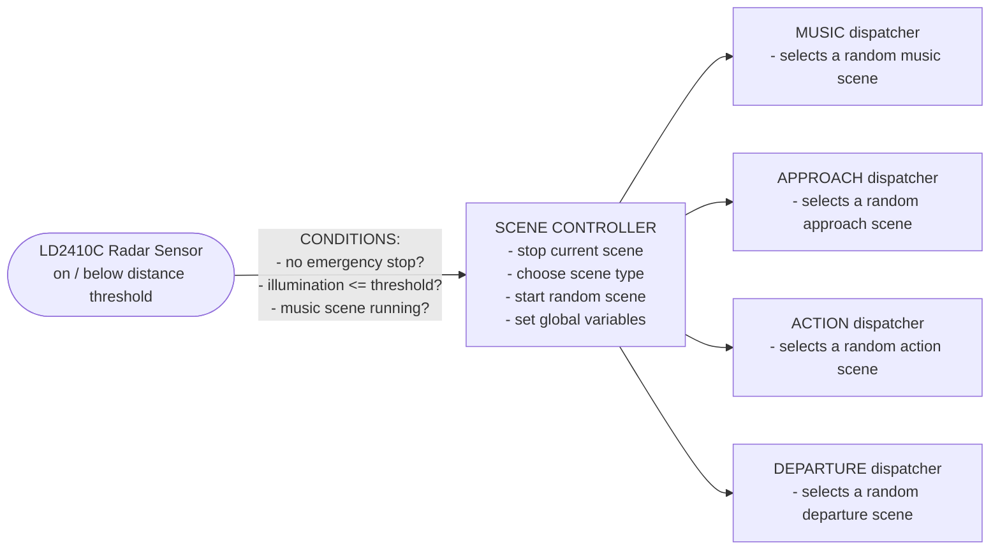
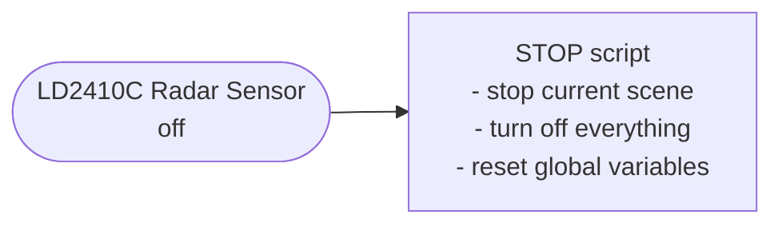

## Hardware

## Pinout

| Pin    | Target       | Note               |
| ------ | ------------ | ------------------ |
| GPIO1  | DF-Player TX |                    |
| GPIO3  | DF-Player RX |                    |
| GPIO5  | Power-LED 2  | Flash/Thunder      |
| GPIO13 | Power-LED 1  | Flash/Thunder      |
| GPIO15 | 5V Fan       |                    |
| GPIO16 | LD2410C RX   | Radar-Sensor       |
| GPIO17 | LD2410C TX   | Radar-Sensor       |
| GPIO18 | Power-LED 4  | Flash/Thunder      |
| GPIO19 | Power-LED 3  | Flash/Thunder      |
| GPIO21 | BH1750 SDA   | Ambient Light      |
| GPIO22 | BH1750 SCL   | Ambient Light      |
| GPIO23 | WS2812 Data  | RGB LED-Strip      |
| GPIO26 | Power-LED 5  | Flash/Thunder      |
| GPIO36 | Red Buzzer   | _(only Input Pin)_ |

> GPIO7-11 are not allowed to be used (SPI bus for flash memory)  
> GPIO34-36+39 are input only pins  
> GPIO1+3 must be used with care and can only be used with disable logging via UART

## Trigger 

